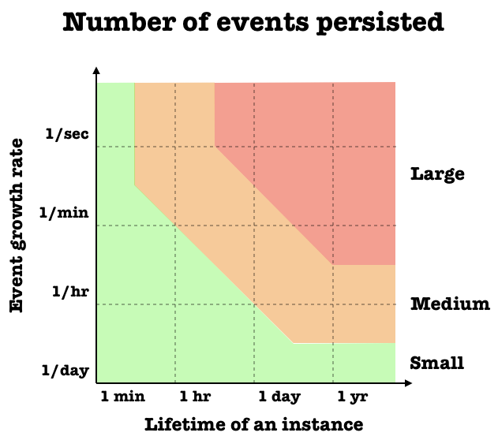

# The Aggregate Design Canvas

The Aggregate Design Canvas is a modelling tool meant to be used as a part of design-level domain modelling activities. 
Canvas Design Aggregate یک ابزار مدل سازی است که به عنوان بخشی از فعالیت های مدل سازی دامنه در سطح طراحی مورد استفاده قرار می گیرد.

An aggregate is a lifecycle pattern originally described by Eric Evans. By aggregate, we understand a graph of objects that is a consistency boundary for our domain policies. Depending on the design of the aggregate we can either enforce them (make them invariant) or be forced to have corrective policies in place. Because of that it is important to design the boundaries of aggregates well, as they impact behaviours modelled within our domain.

یک Aggregate الگوی چرخه حیات است که در ابتدا توسط اریک ایوانز توصیف شد.به وسیله Aggregate، نموداری از اشیاء را می‌فهمیم که یک مرز سازگاری برای سیاستهای دامنه ما است.بسته به طرحی Aggregate، می‌توانیم آن‌ها را اجبار به اجرا کنیم (آنها را تغییرناپذیر کنیم) یا مجبور به اعمال سیاست‌های اصلاحی در محل باشیم.به همین دلیل مهم است که مرزهای Aggregate را به خوبی طراحی کنیم، زیرا آنها بر رفتارهای مدل‌سازی شده در دامین ما تأثیر می‌گذارند.

The canvas has a suggested order of working through it, that helps to iteratively discuss different aspects of the aggregate design.
بوم دارای یک ترتیب پیشنهادی برای کار بر روی آن است که به بحث تکراری جنبه‌های مختلف طرحی Aggregate کمک می‌کند.

### Downloads

- [Aggregate Design Canvas FARSI (png)](resources/aggregate-design-canvas-v1-farsi.png "Aggregate Design Canvas FARSI (png)")
- [Aggregate Design Canvas (jpg)](resources/aggregate-design-canvas-v1.jpg "Aggregate Design Canvas (jpg)")
- [Aggregate Design Canvas (pdf)](resources/aggregate-design-canvas-v1.pdf "Aggregate Design Canvas (pdf)")
- [Aggregate Design Canvas (miro board backup)](resources/aggregate-design-canvas-v1.rtb "Aggregate Design Canvas (miro board backup)")
- [Aggregate Design Canvas (drawio svg)](resources/aggregate-design-canvas-v1.drawio.svg "Aggregate Design Canvas (drawio svg)")

## How to Use - چگونگی استفاده

### 1. Name
Give your aggregate a good name. In some domains it makes sense to include as part of the name the length of a cycle, or some other indication of the life span of the aggregate.

### 1. نام
به aggregate خود یک نام خوب بدهید. در برخی دامین ها منطقی است که به عنوان بخشی از نام، طول یک چرخه، یا نشانه‌های دیگری از طول عمر aggregate را در نظر بگیریم.

### 2. Description
Summarise the main responsibilities and purpose of the aggregate. It’s a good idea to include the reasons why such boundaries were chosen and tradeoffs that were made compared to other designs.

### 2. توضیحات
مسئولیت های اصلی و هدف aggregate را خلاصه کنید. ایده خوبی است که دلایل انتخاب چنین مرزها و مبادله هایی که در مقایسه با طرح های دیگر ایجاد شده است را نیز درج کنید.

### 3. State Transitions

Usually the aggregate goes through explicit state transitions, that impact the way it can be interacted with. Too many transitions might indicate that process boundaries weren't modelled properly and can be split. Very naive / simple transitions might indicate that the aggregate is anaemic and that logic was pushed out to services. In this section of the canvas list the possible states or draw a small transition diagram. 

### 3. انتقال وضعیت

معمولاً aggregate از طریق انتقال وضعیت صریح می گذرد، که بر نحوه تعامل با آن تأثیر می گذارد.انتقال بسیار خام / ساده ممکن است نشان دهد که کل ضعیف است و منطق به سمت سرویس‌ها سوق داده شد.در این بخش از بوم وضعیت های ممکن را فهرست کنید یا یک نمودار انتقال کوچک رسم کنید.

### 4. Enforced Invariants & 5. Corrective Policies

One of the main jobs of the aggregate is to enforce business invariants. These invariants protect business logic. Listing the main ones in this section will make sure that you agree on the responsibilities that the aggregate has. A large number of enforced invariants can indicate high local complexity of the aggregate implementation.

If you decide to change the boundaries of the aggregate and relax some of the invariants (for example to reduce the chance of concurrency conflict), then some extra business logic might be required to correct some of the inconsistencies. In the context of this canvas, we call this logic corrective policies. A large number of such policies might indicate that the business logic was pushed outside of the aggregate, which can increase the complexity of implementation.

Listing on the canvas both Invariants and Corrective Policies will make design trade-offs explicit and will help you decide whether the boundaries you decided on are useful or not.

### 4. ثابت های اجباری و 5. سیاست های اصلاحی

یکی از کارهای اصلی aggregate، ثابت های اجباری کسب و کار است. این ثابت ها از منطق کسب و کار محافظت می کنند.فهرست کردن موارد اصلی در این بخش، اطمینان حاصل می‌کند که در مورد مسئولیت‌هایی که aggregate بر عهده دارد توافق دارید.تعداد زیادی از ثابت های اجباری می تواند پیچیدگی محلی بالای پیاده سازی aggregate را نشان دهد.

اگر تصمیم دارید مرزهای aggregate را تغییر دهید و برخی از ثابت ها را کاهش دهید (مثلاً برای کاهش احتمال تضاد همزمانی)، ممکن است برای اصلاح برخی از تناقضات، به منطق کسب و کار اضافی نیاز باشد.در چارچوب این بوم، این منطق را سیاست های اصلاحی می نامیم. تعداد زیادی از چنین سیاست‌هایی ممکن است نشان‌دهنده این باشد که منطق کسب‌وکار به خارج از aggregate سوق داده شده است، که می‌تواند پیچیدگی پیاده سازی را افزایش دهد.

فهرست‌بندی روی بوم هم سیاست‌های ثابت و هم اصلاح‌کننده، مبادلات طراحی را روشن می‌سازد و به شما کمک می‌کند تصمیم بگیرید که آیا مرزهایی که انتخاب کردید مفید هستند یا خیر.

### 6. Handled Commands & 7. Created Events

In this section you list all the commands that the aggregate is capable of handling and all events that will be created as a result. It might be a good idea to create connectors between them in order to validate that you are not missing any of the building blocks.

### 6. دستورات مدیریت شده و 7. رویدادهای ایجاد شده

در این بخش تمام دستوراتی را که aggregate قادر به انجام آنها است و همه رویدادهایی که در نتیجه ایجاد می شوند را فهرست می کنید. ممکن است ایده خوبی باشد که بین آنها اتصالاتی ایجاد کنید تا تأیید کنید که هیچ یک از اجزاءسازنده را از دست نمی دهید.

### 8. Throughput

The goal of this section is to estimate how likely a single aggregate instance is going to be involved in concurrency conflicts (when two or more competing callers try to make changes at the same time). For each metric estimate the average and maximum - it will help you to reason about the outliers as they often drive the boundary reevaluation.

The Command handling rate metric describes the rate at which the aggregate is processing new commands. On the other hand the Total number of clients says how many clients are likely to issue these commands.

To give you an example - if an aggregate models a basket on the website then it’s likely there will be only one client issuing commands to this basket. If we compare it to an aggregate that models a conference booking system then it’s likely we are going to have tens or hundreds of clients trying to book tickets.

#### Aggregate concurrency conflict chance evaluation chart

Putting these metrics on a graph will give you a rough estimate of a Concurrency conflict chance, which is what we are ultimately looking for. Plotting both Avg and Max for multiple alternatives will allow you to explicitly talk about the throughput tradeoffs. Generally speaking, aiming for a small chance of conflict will deliver better customer experience, but will also increase the complexity of implementation. Or if we put it in a different way: bigger aggregates will have higher chance of concurrency conflict, but less policies to correct data.

### 8. توان عملیاتی

هدف این بخش تخمین این است که چقدر احتمال دارد یک نمونه Aggregate در تضادهای همزمان درگیر باشد (زمانی که دو یا چند صدا زننده رقیب سعی در ایجاد تغییرات در یک زمان دارند).برای هر معیار میانگین و حداکثر را تخمین بزنید - این به شما کمک می کند تا در مورد نقاط پرت استدلال کنید زیرا آنها اغلب ارزیابی مجدد مرز را انجام می دهند.

معیار نرخ مدیریت دستور، سرعتی را که Aggregate در حال پردازش دستورات جدید است، توصیف می کند. از سوی دیگر، تعداد کل کلاینت‌ها می‌گوید که چه تعداد مشتری احتمالاً این دستورات را صادر می‌کنند.

برای مثال، اگر یک Aggregate یک سبد خرید را در وب‌سایت مدل‌سازی کند، احتمالاً تنها یک مشتری دستورات را برای این سبد صادر می‌کند. اگر آن را با Aggregateای مقایسه کنیم که سیستم رزرو کنفرانس را مدل‌سازی می‌کند، احتمالاً ده‌ها یا صدها مشتری در تلاش برای رزرو بلیط خواهیم بود.

#### نمودار ارزیابی شانس مغایرت همزمانی Aggregate

قرار دادن این معیارها در یک نمودار، تخمین تقریبی از شانس مغایرت Concurrency را به شما می دهد، چیزی که در نهایت به دنبال آن هستیم. ترسیم هر دو میانگین و حداکثر برای چندین گزینه به شما این امکان را می دهد که به صراحت در مورد مبادله توان صحبت کنید. به طور کلی، هدف گذاری برای یک شانس کوچک مغایرت، تجربه بهتری را برای مشتری ارائه می دهد، اما پیچیدگی پیاده سازی را نیز افزایش می دهد. یا اگر آن را به گونه ای دیگر بیان کنیم: Aggregate های بزرگتر شانس درگیری همزمانی بالاتری خواهند داشت، اما سیاست های کمتری برای اصلاح داده ها خواهند داشت.

### 9. Size

The last section of the canvas will help you estimate the hypothetical size of the aggregate. In this case the size itself is being measured in the number of events per aggregate instance. Depending on how you model the domain, the events might end up being fine or coarse grained, so the size of the events will also play a role. 

E.g. a `OrderCreated` event could have multiple `LineItems` as part of the event, or model these line items as separate `LineItemAdded` events. In case of coarse grained events, the overall size of the aggregate will be bigger, even if the number of events is small.

The Event growth rate metric should estimate how many events are appended to a single aggregate instance. The Lifetime of an instance will tell us how long the instance is going to live and as a consequence how many events will be accumulated and fetched when we need to process a new command.

#### Aggregate size evaluation chart

Medium and large number of events might impact the customer experience and make the command handling slow. Fortunately, in most cases this can be dealt with using snapshots. Another thing to look for are long-lived instances (potentially infinite). This might cause problems when it comes to archiving data and ever growing streams. For that reason it’s usually a good heuristic to scope the aggregate to a specific time period (e.g. billing period).

### 9. اندازه

آخرین بخش بوم به شما کمک می کند اندازه فرضی Aggregate را تخمین بزنید. در این مورد، اندازه به خودی خود در تعداد رویدادها در هر نمونه Aggregate اندازه گیری می شود. بسته به اینکه چگونه دامنه را مدل می کنید، رویدادها ممکن است در نهایت کوچک یا بزرگ باشند، بنابراین اندازه رویدادها نیز نقشی ایفا می کند.

به عنوان مثال. یک رویداد «OrderCreated» می‌تواند چندین «LineItems» را به عنوان بخشی از رویداد داشته باشد، یا این line item ها را به‌عنوان رویدادهای «LineItemAdded» جداگانه مدل‌سازی کند. در صورت رخدادهای بزرگ، اندازه کلی Aggregate بزرگتر خواهد بود، حتی اگر تعداد رویدادها کم باشد.

معیار نرخ رشد رویداد باید تخمین بزند که چند رویداد به یک نمونه Aggregate اضافه شده است. طول عمر یک نمونه به ما می‌گوید که چه مدت قرار است این نمونه زنده بماند و در نتیجه زمانی که ما نیاز به پردازش یک دستور جدید داریم، چه تعداد رویداد جمع‌آوری و واکشی می‌شود.

#### نمودار ارزیابی اندازه Aggregate

تعداد متوسط و زیاد رویدادها ممکن است بر تجربه مشتری تأثیر بگذارد و مدیریت دستورات را کند کند. خوشبختانه، در اکثر موارد می توان با استفاده از snapshot ها با این مشکل برخورد کرد. یکی دیگر از مواردی که باید به دنبال آن باشید، نمونه های طولانی مدت (به طور بالقوه نامحدود) هستند. این ممکن است هنگام بایگانی داده ها و جریان های (streamهای) در حال رشد مشکلاتی ایجاد کند. به همین دلیل معمولاً یک اکتشافی خوب است که Aggregate را به یک دوره زمانی خاص (مثلاً دوره صورتحساب) اختصاص دهیم.

## Additional Resources

- [Domain-Driven Design: A mathematical model for process-oriented Aggregates pt. I](https://medium.com/@tPl0ch/domain-driven-design-a-mathematical-model-for-process-oriented-aggregates-pt-i-6aecc8957865)
- [Modelling aggregates with "Aggregate Design Canvas"](https://domaincentric.net/blog/modelling-aggregates-with-aggregate-design-canvas)
- [Modelling Aggregates: Invariants vs Corrective Policies](https://domaincentric.net/blog/modelling-business-rules-invariants-vs-corrective-policies)

## Examples

### Naive bank account

## Contributors

Thanks to all [existing and future contributors](https://github.com/ddd-crew/aggregate-design-canvas/graphs/contributors) and to [Mathew McLoughlin](https://github.com/mat-mcloughlin) who has contributed to the Aggregate Design Canvas:

The canvas was inspired by the [Bounded Context Canvas](https://github.com/ddd-crew/bounded-context-canvas).

## Contributions and Feedback

The Aggregate Design Canvas is freely available for you to use. In addition, your feedback and ideas are welcome to improve the canvas or to create new versions. 

Feel free to also send us a pull request with your examples.

[![CC BY 4.0][cc-by-shield]][cc-by]

This work is licensed under a [Creative Commons Attribution 4.0 International
License][cc-by].

[![CC BY 4.0][cc-by-image]][cc-by]

[cc-by]: http://creativecommons.org/licenses/by/4.0/
[cc-by-image]: https://i.creativecommons.org/l/by/4.0/88x31.png
[cc-by-shield]: https://img.shields.io/badge/License-CC%20BY%204.0-lightgrey.svg
